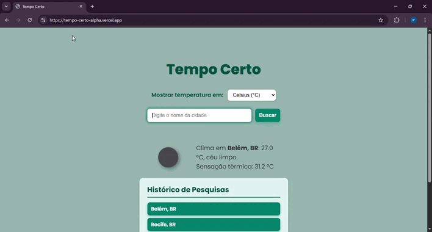

# Tempo Certo

Este projeto é um **Dashboard de Clima** simples que permite ao usuário consultar o clima atual de qualquer cidade utilizando a API do OpenWeatherMap. A interface exibe temperatura, descrição, sensação térmica e ícone representativo do clima.

🔗 [Acesse o projeto online](https://tempo-certo-alpha.vercel.app/)

---

## Funcionalidades

- Consulta o clima atual por cidade.  
- Exibe temperatura, descrição e ícone representativo do clima.  
- Histórico das últimas pesquisas (armazenado localmente).  
- Permite escolher unidades de temperatura (Celsius ou Fahrenheit).  
- Mensagens de erro para cidade não encontrada ou campo vazio.

---

## Demonstração

---

## Tecnologias Utilizadas

- HTML5  
- CSS3  
- JavaScript (fetch API para consumo da OpenWeatherMap)  
- API do [OpenWeatherMap](https://openweathermap.org/api)

---

## Configuração da API

Você precisa obter uma chave (API Key) gratuita no site do [OpenWeatherMap](https://openweathermap.org/api) e substituir a variável `apiKey` no arquivo `script.js` com sua própria chave.

---

## Melhorias Futuras

- Adicionar previsão estendida (dias seguintes).
- Melhorar responsividade e layout mobile.

---

## Autor

Paulo Henrique Santos
